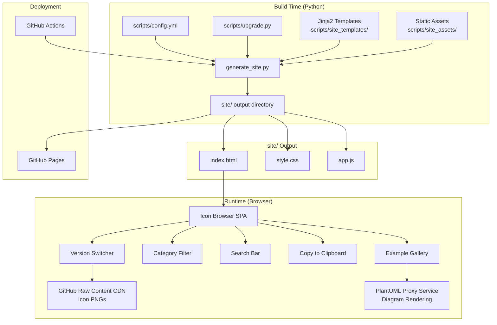

# Design Document: GitHub Pages Icon Browser

## Overview

This design describes a static website generator and client-side application for browsing the AWS Icons for PlantUML catalog. The system has two main parts:

1. **Site Generator** (`scripts/generate_site.py`) — A Python script that reads `scripts/config.yml` and `scripts/upgrade.py`, processes the data through Jinja2 templates, and outputs a self-contained static site to a `site/` directory.

2. **Client-Side Application** — HTML, CSS, and JavaScript that provides icon browsing, version switching, category filtering, search, clipboard copy, and an example diagram gallery. All interactivity is client-side DOM manipulation with no server-side logic.

The site is deployed to GitHub Pages via a GitHub Actions workflow triggered on release tag creation or push to main.

### Key Design Decisions

- **Single-page application approach**: All icons for the current version (v23.0) are rendered into the HTML at build time. Version switching updates image URLs and PUML paths client-side using the embedded icon data JSON. This avoids generating separate pages per version and keeps the build simple.
- **Embedded data over fetch**: Icon catalog data and category mapping tables are embedded as inline `<script>` JSON in the HTML rather than loaded via fetch. This eliminates CORS issues and works with any static hosting.
- **CSS-only CloudScape styling**: We use CloudScape design tokens as CSS custom properties rather than importing the React component library. This keeps the site lightweight and dependency-free on the client side.
- **Python script in `scripts/`**: The generator lives alongside existing build tools (`icon-builder.py`, `upgrade.py`) and follows the same `uv run` execution pattern.

## Architecture



### Data Flow

1. **Build phase**: `generate_site.py` loads `config.yml` via PyYAML, imports `BREAKING_CHANGES` and `SUPPORTED_VERSIONS` from `upgrade.py`, processes Jinja2 templates, copies static assets, and writes everything to `site/`.
2. **Page load**: The browser renders the HTML with all icon cards pre-rendered for v23.0. The embedded JSON contains the full icon catalog and category mapping table.
3. **User interaction**: JavaScript handles version switching (updating image `src` and text), category filtering (toggling `display` on category sections), search (toggling `display` on individual cards), and clipboard operations.
4. **External resources**: Icon PNG images are loaded from `https://raw.githubusercontent.com/awslabs/aws-icons-for-plantuml/{version}/dist/{Category}/{Target}.png`. Example diagrams are rendered via the PlantUML proxy service.

## Components and Interfaces

### 1. Site Generator (`scripts/generate_site.py`)

The main build script. Responsible for:

- Parsing `config.yml` to extract the icon catalog
- Importing version and breaking changes data from `upgrade.py`
- Building the category mapping table for cross-version navigation
- Rendering Jinja2 templates with the processed data
- Copying static CSS/JS assets to the output directory

```python
def main():
    """Entry point for site generation."""
    config = load_config("config.yml")
    icon_data = extract_icon_data(config)
    category_mapping = build_category_mapping()
    examples = build_example_list()
    
    render_site(
        output_dir="site",
        icon_data=icon_data,
        category_mapping=category_mapping,
        examples=examples,
        supported_versions=SUPPORTED_VERSIONS,
        current_version=SUPPORTED_VERSIONS[-1],
    )
```

**Key functions:**

| Function | Input | Output | Description |
|---|---|---|---|
| `load_config(path)` | YAML file path | `dict` | Parses config.yml, returns raw config dict |
| `extract_icon_data(config)` | Config dict | `IconData` | Extracts categories, icons, colors into structured data |
| `build_category_mapping()` | (reads upgrade.py data) | `dict` | Builds forward/reverse category rename mapping per version |
| `build_example_list()` | (reads examples/ dir + README) | `list[Example]` | Curates the example diagram list with titles and URLs |
| `render_site(...)` | All processed data | Files on disk | Renders templates and writes to output directory |

### 2. Jinja2 Templates (`scripts/site_templates/`)

| Template | Purpose |
|---|---|
| `index.html.j2` | Main page layout: nav bar, version selector, search bar, category filters, icon grid, example gallery |
| `_icon_card.html.j2` | Partial for a single icon card |
| `_example_card.html.j2` | Partial for a single example diagram |

The main template embeds three JSON data blocks in `<script>` tags:

- `window.ICON_DATA` — Full icon catalog (categories → icons with Target, Target2, color)
- `window.CATEGORY_MAPPING` — Cross-version category rename/deletion table
- `window.SUPPORTED_VERSIONS` — Ordered list of version strings

### 3. Client-Side JavaScript (`scripts/site_assets/app.js`)

A single vanilla JavaScript file (no framework dependencies) that handles all interactivity:

| Module/Function | Responsibility |
|---|---|
| `initVersionSelector()` | Populates version dropdown, handles version change events |
| `switchVersion(version)` | Updates all icon image URLs and PUML paths to the selected version |
| `initCategoryFilter()` | Renders category filter checkboxes, handles toggle events |
| `updateCategoryList(version)` | Rebuilds category filter list when version changes |
| `resolveCategoryMapping(category, fromVersion, toVersion)` | Walks the mapping table to find the equivalent category name |
| `filterByCategory(categories)` | Shows/hides category sections based on selection |
| `initSearch()` | Attaches input listener to search bar |
| `filterBySearch(query)` | Case-insensitive match against Target and Target2, toggles card visibility |
| `applyFilters()` | Combines active category filter + search to determine final visibility |
| `copyToClipboard(text, button)` | Copies PUML include URL, shows confirmation feedback |
| `updateIconCounts()` | Updates total and visible icon count display |

### 4. CSS Styling (`scripts/site_assets/style.css`)

CloudScape-inspired CSS using custom properties for design tokens:

```css
:root {
    /* CloudScape-derived tokens */
    --color-background-layout-main: #ffffff;
    --color-background-container-content: #ffffff;
    --color-background-container-header: #fafafa;
    --color-border-divider-default: #e9ebed;
    --color-text-body-default: #000716;
    --color-text-heading-default: #000716;
    --color-text-body-secondary: #414d5c;
    --color-background-button-primary-default: #0972d3;
    --font-family-base: "Amazon Ember", "Helvetica Neue", Roboto, Arial, sans-serif;
    --font-size-body-m: 14px;
    --font-size-heading-l: 24px;
    --space-xs: 4px;
    --space-s: 8px;
    --space-m: 12px;
    --space-l: 20px;
    --space-xl: 24px;
    --border-radius-container: 16px;
    --border-radius-button: 8px;
}
```

### 5. GitHub Actions Workflow (`.github/workflows/deploy-pages.yml`)

```yaml
name: Deploy Icon Browser to GitHub Pages

on:
  push:
    branches: [main]
  release:
    types: [created]

permissions:
  contents: read
  pages: write
  id-token: write

concurrency:
  group: "pages"
  cancel-in-progress: false

jobs:
  build:
    runs-on: ubuntu-latest
    steps:
      - uses: actions/checkout@v4
      - uses: astral-sh/setup-uv@v6
      - run: uv sync
      - run: uv run scripts/generate_site.py
      - uses: actions/upload-pages-artifact@v3
        with:
          path: site/

  deploy:
    needs: build
    runs-on: ubuntu-latest
    environment:
      name: github-pages
      url: ${{ steps.deployment.outputs.page_url }}
    steps:
      - id: deployment
        uses: actions/deploy-pages@v4
```

## Data Models

### Icon Data JSON (embedded in HTML)

This is the primary data structure embedded in the generated HTML page. It contains the full icon catalog extracted from `config.yml`.

```json
{
  "categories": {
    "Analytics": {
      "color": "#8C4FFF",
      "colorName": "Galaxy",
      "icons": [
        {
          "target": "Athena",
          "target2": "athena",
          "pumlPath": "Analytics/Athena.puml",
          "pngPath": "Analytics/Athena.png"
        }
      ]
    }
  },
  "defaults": {
    "colors": {
      "Nebula": "#C925D1",
      "Mars": "#DD344C"
    }
  }
}
```

### Category Mapping Table (embedded in HTML)

Maps category renames and deletions across version transitions. Each entry represents a version where a change occurred.

```json
{
  "v13.0": {
    "renames": {"ARVR": "VRAR", "AWSCostManagement": "CloudFinancialManagement"},
    "deletions": []
  },
  "v13.1": {
    "renames": {"GroupIcons": "Groups"},
    "deletions": []
  },
  "v15.0": {
    "renames": {"GameTech": "Games"},
    "deletions": []
  },
  "v16.0": {
    "renames": {},
    "deletions": ["VRAR"]
  },
  "v19.0": {
    "renames": {"MachineLearning": "ArtificialIntelligence", "MigrationTransfer": "MigrationModernization"},
    "deletions": []
  },
  "v22.0": {
    "renames": {},
    "deletions": ["Robotics"]
  },
  "v23.0": {
    "renames": {},
    "deletions": ["ContactCenter"]
  }
}
```

### Python Data Structures

```python
@dataclass
class IconEntry:
    """A single icon extracted from config.yml."""
    target: str        # PascalCase name, e.g. "Athena"
    target2: str       # kebab-case name, e.g. "athena"
    category: str      # Parent category, e.g. "Analytics"

@dataclass
class CategoryData:
    """A category with its color and icons."""
    name: str          # e.g. "Analytics"
    color: str         # Hex color, e.g. "#8C4FFF"
    color_name: str    # Named color, e.g. "Galaxy"
    icons: list[IconEntry]

@dataclass
class ExampleDiagram:
    """An example PlantUML diagram for the gallery."""
    title: str         # Display title
    description: str   # Brief description
    puml_url: str      # Raw GitHub URL to the .puml file
    proxy_url: str     # PlantUML proxy rendering URL
    source_path: str   # Relative path in repo, e.g. "examples/HelloWorld.puml"

@dataclass
class IconData:
    """Complete icon catalog for template rendering."""
    categories: dict[str, CategoryData]
    defaults: dict
```

### Example Diagram Data

The example list is curated at build time. Each entry maps to a `.puml` file in the repository:

| Example | Source Path | Description |
|---|---|---|
| Hello World | `examples/HelloWorld.puml` | Basic two-service diagram |
| Basic Usage | `examples/Basic Usage.puml` | IoT Rules Engine workflow |
| Raw Image Usage | `examples/Raw Image Usage.puml` | Using icon images directly |
| Sequence - Technical | `examples/Sequence - Technical.puml` | Sequence diagram with stereotypes |
| Sequence - Images | `examples/Sequence - Images.puml` | Sequence diagram with images |
| Groups - VPC | `examples/Groups - VPC.puml` | VPC with availability zones |
| Groups - CodePipeline | `examples/Groups - CodePipeline.puml` | CodePipeline approval workflow |


## Correctness Properties

*A property is a characteristic or behavior that should hold true across all valid executions of a system — essentially, a formal statement about what the system should do. Properties serve as the bridge between human-readable specifications and machine-verifiable correctness guarantees.*

### Property 1: Config extraction preserves all icons and categories

*For any* valid config dictionary containing categories with icons (each having Target, Target2, and color fields), the `extract_icon_data` function SHALL produce an `IconData` structure where every category from the input appears as a key, every icon's Target and Target2 values are present in the corresponding category's icon list, and every category's color is correctly resolved from the Defaults.Colors mapping.

**Validates: Requirements 1.1, 1.4**

### Property 2: Rendered HTML contains complete icon cards

*For any* `IconData` structure with at least one category and one icon, the rendered HTML output SHALL contain: (a) a category section heading for every category, (b) an icon card for every icon within each category, and (c) each icon card SHALL contain the icon's Target name, the PNG image URL, and the PUML include path.

**Validates: Requirements 2.1, 2.2**

### Property 3: Icon URL construction follows the canonical pattern

*For any* valid combination of version string (from SUPPORTED_VERSIONS), category name, and Target name, the constructed PNG URL SHALL equal `https://raw.githubusercontent.com/awslabs/aws-icons-for-plantuml/{version}/dist/{category}/{target}.png` and the constructed PUML include URL SHALL equal `!include https://raw.githubusercontent.com/awslabs/aws-icons-for-plantuml/{version}/dist/{category}/{target}.puml`.

**Validates: Requirements 2.3, 6.1**

### Property 4: Combined search and category filter intersection

*For any* list of icons, any search query string, and any set of selected categories (including "all"), the filter function SHALL return exactly the icons where: (a) the icon's category is in the selected set (or all categories are selected), AND (b) the icon's Target or Target2 contains the search query as a case-insensitive substring (or the search query is empty).

**Validates: Requirements 5.2, 5.3, 5.5**

### Property 5: All icon images have descriptive alt text

*For any* `IconData` structure, every `` element in the rendered HTML for icon cards SHALL have a non-empty `alt` attribute that contains the icon's Target name.

**Validates: Requirements 10.2**

### Property 6: Cross-version category resolution correctness

*For any* category name that exists in version A, and any target version B (where A and B are both in SUPPORTED_VERSIONS), the `resolveCategoryMapping` function SHALL: (a) return the renamed category name if the category was renamed between A and B (walking forward through renames when B > A, or reversing renames when B < A), (b) return `null` if the category was deleted between A and B, or (c) return the original category name unchanged if no rename or deletion applies between A and B.

**Validates: Requirements 11.5, 11.6, 11.7, 11.8, 11.9**

## Error Handling

### Build-Time Errors (Site Generator)

| Error Condition | Handling | Exit Code |
|---|---|---|
| `config.yml` not found or unreadable | Print error message with expected path, exit | 1 |
| `config.yml` invalid YAML syntax | Print PyYAML parse error with line number, exit | 1 |
| `config.yml` missing required fields (Categories, Defaults) | Print validation error specifying missing field, exit | 1 |
| Jinja2 template not found | Print missing template path, exit | 1 |
| Jinja2 template rendering error | Print template name and Jinja2 error details, exit | 1 |
| Output directory not writable | Print permission error, exit | 1 |
| `upgrade.py` import failure | Print import error, exit | 1 |

The generator uses `sys.exit(1)` for all fatal errors, consistent with the existing `icon-builder.py` pattern. This ensures GitHub Actions workflows fail on build errors (Requirement 9.6).

### Client-Side Errors (Browser)

| Error Condition | Handling |
|---|---|
| Icon PNG fails to load (404, network error) | `onerror` handler hides the broken image and shows a placeholder icon (CSS fallback) |
| PlantUML proxy fails to render example diagram | `onerror` handler on `` replaces with a message: "Diagram unavailable" and a link to the source `.puml` file (Requirement 7.5) |
| Clipboard API unavailable (`navigator.clipboard` undefined) | Fallback to creating a temporary `<textarea>`, selecting the text, and using `document.execCommand('copy')`. If that also fails, select the text for manual copy (Requirement 6.4) |
| Embedded JSON data missing or malformed | Console error logged; page renders in a degraded state showing the static HTML without interactive features |
| Version not found in SUPPORTED_VERSIONS | Ignored; version selector only contains valid options from the embedded data |

## Testing Strategy

### Unit Tests (Python — pytest)

Test the site generator's data processing logic:

| Test Area | What to Test | Type |
|---|---|---|
| `load_config` | Valid YAML parsing, missing file error, invalid YAML error | Example |
| `extract_icon_data` | Correct extraction of categories, icons, colors from config dict | Property (Property 1) |
| `build_category_mapping` | Correct rename/deletion entries for all version transitions | Example |
| `build_example_list` | Expected examples are included with correct URLs | Example |
| `render_site` | Output directory contains expected files | Smoke |
| URL construction helpers | PNG and PUML URLs follow canonical pattern | Property (Property 3) |

### Unit Tests (JavaScript — inline or lightweight test runner)

Since this is a static site with vanilla JS, JavaScript logic can be tested by extracting pure functions and testing them with a lightweight approach (e.g., a simple Node.js test script or inline assertions during development):

| Test Area | What to Test | Type |
|---|---|---|
| `resolveCategoryMapping` | Forward renames, reverse renames, deletions, identity | Property (Property 6) |
| `filterBySearch` | Case-insensitive matching against Target and Target2 | Property (Property 4) |
| `applyFilters` | Combined search + category filter intersection | Property (Property 4) |
| `buildIconUrl` / `buildPumlUrl` | URL pattern correctness | Property (Property 3) |
| `copyToClipboard` | Clipboard API call with correct text, fallback behavior | Example |

### Property-Based Tests

Property-based tests use **Hypothesis** (Python) for server-side logic and **fast-check** (JavaScript/Node.js) for client-side logic. Each property test runs a minimum of 100 iterations.

| Property | Library | Tag |
|---|---|---|
| Property 1: Config extraction completeness | Hypothesis | `Feature: github-pages-icon-browser, Property 1: Config extraction preserves all icons and categories` |
| Property 2: HTML rendering completeness | Hypothesis | `Feature: github-pages-icon-browser, Property 2: Rendered HTML contains complete icon cards` |
| Property 3: URL construction correctness | Hypothesis | `Feature: github-pages-icon-browser, Property 3: Icon URL construction follows the canonical pattern` |
| Property 4: Combined filter correctness | fast-check | `Feature: github-pages-icon-browser, Property 4: Combined search and category filter intersection` |
| Property 5: Alt text presence | Hypothesis | `Feature: github-pages-icon-browser, Property 5: All icon images have descriptive alt text` |
| Property 6: Category resolution correctness | fast-check | `Feature: github-pages-icon-browser, Property 6: Cross-version category resolution correctness` |

### Integration Tests

| Test | Description |
|---|---|
| Full site generation | Run `generate_site.py` against the real `config.yml`, verify output directory structure and file contents |
| HTML validation | Validate generated HTML against W3C standards (no broken tags, valid structure) |
| Accessibility audit | Run axe-core or similar tool against the generated HTML for WCAG 2.1 AA compliance |

### Manual Testing

| Test | Description |
|---|---|
| Visual review | Compare site appearance against CloudScape design patterns |
| Responsive layout | Test at 320px, 768px, 1024px, 1440px, 1920px viewport widths |
| Keyboard navigation | Tab through all controls, verify logical order and focus indicators |
| Screen reader | Test with VoiceOver/NVDA for correct announcements |
| Cross-browser | Verify in Chrome, Firefox, Safari, Edge |
