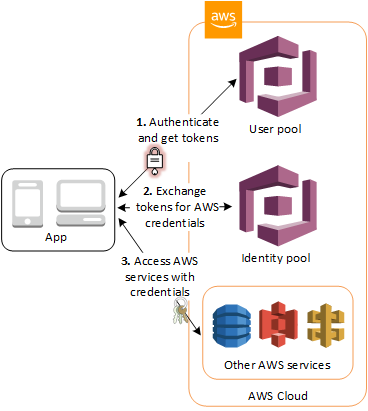

# Creating a Sequence Diagram for an Amazon Cognito scenario

Using this example from the [What is Amazon Cognito?](https://docs.aws.amazon.com/cognito/latest/developerguide/what-is-amazon-cognito.html) documentation, we will iteratively build out a sequence diagram. We will first using the basic features of PlantUML, then add some syntax to enhance the diagram, and lastly add AWS Icons and colors.

> **An Amazon Cognito user pool and identity pool used together**
>
> See the diagram for a common Amazon Cognito scenario. Here the goal is to authenticate your user, and then grant your user access to another AWS service.
>
> 1. In the first step your app user signs in through a user pool and receives user pool tokens after a successful authentication.
> 2. Next, your app exchanges the user pool tokens for AWS credentials through an identity pool.
> 3. Finally, your app user can then use those AWS credentials to access other AWS services such as Amazon S3 or DynamoDB.



## Basic Diagram

The first version will use basic features:

- declaring `participant` entities
- using `->` for messages and `<--` for return messages
- include an `alt` fragment

```
@startuml Amazon S3 objects using IAM Temporary Credentials

title Amazon S3 objects using IAM Temporary Credentials
' compare with https://docs.aws.amazon.com/cognito/latest/developerguide/what-is-amazon-cognito.html

participant "User" as user
participant "Cognito User Pool" as userpool
participant "Cognito Identity Pool" as idpool
participant "S3 Bucket" as s3
participant "STS" as sts
participant "IAM Policy" as permissions

' 1. Authenticate and get tokens
user -> userpool: InitiateAuth
user <-- userpool: ID Token and Access Token

' 2. Exchange tokens for AWS credentials
user -> idpool: GetCredentialsForIdentity
idpool -> idpool: map to IAM Role
idpool -> sts: AssumeRoleWithWebIdentity(Role)
idpool <-- sts: temporary security credentials
user <-- idpool: temporary security credentials

' 3. Access AWS services with credentials
user -> s3: GetObject
s3 -> permissions: check permissions
alt no access
  s3 <-- permissions: Deny
  user <-- s3: error (AccessDenied)
else access
  s3 <-- permissions: Allow
  user <-- s3: S3 object
end

@enduml
```


## Visual Updates

The next version includes visual updates to enhance the look of the diagram, but still using native PlantUML features.

- Various `skinparam` directives to hide the footer boxes and update the arrowhead and arrow thickness.
- Formatting text for `participant` to include bolded text and newlines.
- Use the `++` syntax to add participant lifelines and the `return` keyword instead of `<--` for return messages.
- Include `note` elements for clarity and emoji symbols ❌ and ✅ for more color.

```
@startuml Amazon S3 objects using IAM Temporary Credentials

title Amazon S3 objects using IAM Temporary Credentials
' compare with https://docs.aws.amazon.com/cognito/latest/developerguide/what-is-amazon-cognito.html

hide footbox
skinparam style strictuml

skinparam participant {
    RoundCorner 0
}
skinparam sequence { 
    ArrowThickness 2
    MessageAlignment left
}

participant "\nUser" as user <<Tenant 1>>
participant "<b>User Pool</b>\nAmazon Cognito" as userpool
participant "<b>Identity Pool</b>\nAmazon Cognito" as idpool
participant "<b>Bucket</b>\nAmazon S3" as s3 <<Multi-Tenant>>
participant "AWS STS" as sts
participant "<b>Policy</b>\nAWS IAM" as permissions

note over userpool
  1. Authenticate and get tokens
end note
user -> userpool++: InitiateAuth
return ID Token and Access Token

note over idpool
  2. Exchange tokens for AWS credentials
end note
user -> idpool++: GetCredentialsForIdentity
idpool -> idpool: map to IAM Role
idpool -> sts++: AssumeRoleWithWebIdentity(Role)
return temporary security credentials
return temporary security credentials

note over s3
  3. Access AWS services with credentials
end note
user -> s3++: GetObject
s3 -> permissions++: check permissions
alt no access
  permissions --> s3: ❌  Deny
  s3 --> user: error (AccessDenied)
else access
  return ✅  Allow
  return S3 object
end

@enduml
```


## AWS Icons and Colors

The final version adds AWS service icons and colors from `aws-icons-for-plantuml` for greater visual impact.

- Each `participant` uses an AWS Icon using a custom `$AWSIcon` participant procedure.
- More `skinparam` directives for background and border colors.
- Custom colors for lifelines based on AWS Icon colors.
- Custom `$AWSReturnIcon` procedure that leverages a custom stereotype on `note` to hide the background and border colors.

```
@startuml Amazon S3 objects using IAM Temporary Credentials

title Amazon S3 objects using IAM Temporary Credentials
' compare with https://docs.aws.amazon.com/cognito/latest/developerguide/what-is-amazon-cognito.html

!define AWSPuml https://raw.githubusercontent.com/awslabs/aws-icons-for-plantuml/v14.0/dist
!include AWSPuml/AWSCommon.puml
!include AWSPuml/General/User.puml
!include AWSPuml/General/SAMLtoken.puml
!include AWSPuml/SecurityIdentityCompliance/Cognito.puml
!include AWSPuml/SecurityIdentityCompliance/IdentityAccessManagementPermissions.puml
!include AWSPuml/SecurityIdentityCompliance/IdentityAccessManagementAWSSTSAlternate.puml
!include AWSPuml/SecurityIdentityCompliance/IdentityAccessManagementTemporarySecurityCredential.puml
!include AWSPuml/SecurityIdentityCompliance/IdentityAccessManagementRole.puml
!include AWSPuml/Storage/SimpleStorageServiceBucket.puml
!include AWSPuml/Storage/SimpleStorageServiceObject.puml

hide footbox
skinparam style strictuml

skinparam participant {
    BackgroundColor AWS_BG_COLOR
    BorderColor AWS_BORDER_COLOR
    RoundCorner 0
}
skinparam sequence { 
    ArrowThickness 2
    LifeLineBorderColor AWS_COLOR
    MessageAlignment left
}
skinparam note {
  TextAlignment left
  BorderColor AWS_COLOR
  BackgroundColor %lighten(AWS_BORDER_COLOR, 75)
}
skinparam WrapWidth 300
skinparam MaxMessageSize 600

!procedure $AWSIcon($service, $line1, $line2="")
participant "$AWSImg($service)\n<b>$line1</b>\n$line2"
!endprocedure 

skinparam note<<ReturnIcon>> {
  BorderColor #Transparent
  BackgroundColor #Transparent
}
!procedure $AWSReturnIcon($service)
note<<ReturnIcon>> left
   %call_user_func("$" + $service + "IMG", "0.5")
end note
!endprocedure 

$AWSIcon(User, " ", "User") as user <<Tenant 1>>
$AWSIcon(Cognito, "User Pool", "Amazon Cognito") as userpool
$AWSIcon(Cognito, "Identity Pool", "Amazon Cognito") as idpool
$AWSIcon(SimpleStorageServiceBucket, "Bucket", "Amazon S3") as s3 <<Multi-Tenant>>
$AWSIcon(IdentityAccessManagementAWSSTSAlternate, " ", "AWS STS") as sts
$AWSIcon(IdentityAccessManagementPermissions, "Policy", "AWS IAM") as permissions

note over userpool
  1. Authenticate and get tokens
end note
user -> userpool++ AWS_COLOR_RED: InitiateAuth
return ID Token and Access Token
note<<ReturnIcon>> left
  $SAMLtokenIMG("0.5") $SAMLtokenIMG("0.5")
end note

note over idpool
  2. Exchange tokens for AWS credentials
end note
user -> idpool++ AWS_COLOR_RED: GetCredentialsForIdentity
idpool -> idpool: map to IAM Role
$AWSReturnIcon(IdentityAccessManagementRole)
idpool -> sts++ %lighten(AWS_COLOR_RED, 75): AssumeRoleWithWebIdentity(Role)
return temporary security credentials
$AWSReturnIcon(IdentityAccessManagementTemporarySecurityCredential)
return temporary security credentials
$AWSReturnIcon(IdentityAccessManagementTemporarySecurityCredential)

note over s3
  3. Access AWS services with credentials
end note
user -> s3++ AWS_COLOR_GREEN: GetObject
s3 -> permissions++ %lighten(AWS_COLOR_RED, 75): check permissions
alt no access
  permissions --> s3: ❌  Deny
  s3 --> user: error (AccessDenied)
else access
  return ✅  Allow
  return S3 object
  $AWSReturnIcon(SimpleStorageServiceObject)
end

@enduml
```


