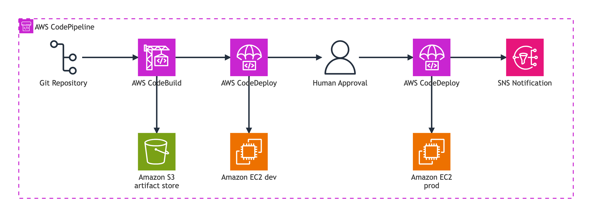

# Mermaid Architecture diagrams

`mermaid.html` uses the Mermaid [architecture](https://mermaid.js.org/syntax/architecture.html) diagram type (`architecture-beta`) with  `dist/aws-icons-mermaid.json`, an experimental AWS Icons [iconifyJSON](https://iconify.design/docs/types/iconify-json.html) formatted icon pack.

Viewing `mermaid.html` requires the "dist" folder being served at http://localhost:8000/ - inside Visual Studio Code you can run the `http.server CORS 8000` task.

```javascript
      import mermaid from 'https://cdn.jsdelivr.net/npm/mermaid@11.4.1/dist/mermaid.esm.mjs';
      let baseUrl = 'http://localhost:8000';
      let icons = await fetch(`${baseUrl}/aws-icons-mermaid.json`).then((res) => res.json());
      mermaid.registerIconPacks([
        {
          name: 'logos',
          loader: () =>
            fetch('https://unpkg.com/@iconify-json/logos@1/icons.json').then((res) => res.json()),
        },
        {
          name: 'aws',
          loader: () => icons
        },
      ]);
      mermaid.initialize({ startOnLoad: true });
```

An example mermaid `architecture-beta` diagram that mimics `Groups - CodePipeline.puml` is below.

```
---
config:
  theme: base
  themeVariables:
    darkMode: false
    archEdgeColor: "#232F3E"
    archEdgeArrowColor: "#232F3E"
    archGroupBorderColor: "#C925D1"
---
architecture-beta
  group cp(aws:codepipeline)[AWS CodePipeline]

    service gr(aws:git-repository)[Git Repository] in cp
    service cb(aws:codebuild)[AWS CodeBuild] in cp
    service cd1(aws:codedeploy)[AWS CodeDeploy] in cp
    service s3(aws:simple-storage-service)[Amazon S3 artifact store] in cp
    service user(aws:user)[Human Approval] in cp
    service dev(aws:ec2)[Amazon EC2 dev] in cp
    service cd2(aws:codedeploy)[AWS CodeDeploy] in cp
    service prod(aws:ec2)[Amazon EC2 prod] in cp
    service sns(aws:simple-notification-service)[SNS Notification] in cp

    gr:R --> L:cb
    cb:R --> L:cd1
    cb:B --> T:s3
    cd1:R --> L:user
    cd1:B --> T:dev
    user:R --> L:cd2
    cd2:B --> T:prod
    cd2:R --> L:sns
```



---

Mermaid may render inline in markdown files - if supported, the Mermaid version currently in use is below:

```mermaid
  info
```

## Generic icons


## AWS icons from iconify.design

```mermaid
architecture-beta
    group api(logos:aws-lambda)[API]

    service db(logos:aws-aurora)[Database] in api
    service disk1(logos:aws-glacier)[Storage] in api
    service disk2(logos:aws-s3)[Storage] in api
    service server(logos:aws-ec2)[Server] in api

    db:L -- R:server
    disk1:T -- B:server
    disk2:T -- B:db  
```


