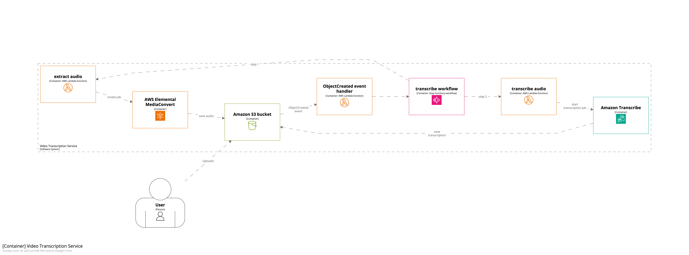
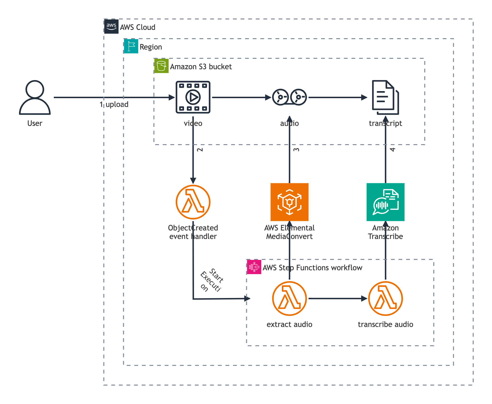

# S3 Upload Workflow examples

The architecture for an "S3 Upload Workflow" is represented across multiple examples.

## S3 Upload Workflow

`S3 Upload Workflow.puml` is a mixture between a structure diagram (network connections between services) and a behavior diagram (numbered message arrows).

## Sequence diagram

`S3 Upload Workflow - sequence.puml` is a the sequence diagram version of this example, using the same numbered messages to make comparing the diagrams easier.

## C4-PlantUML diagram

C4-PlantUML combines the benefits of PlantUML and the [C4 model](https://c4model.com/). `S3 Upload Workflow - C4.puml` uses [C4-PlantUML](https://github.com/plantuml-stdlib/C4-PlantUML) with `$AWSC4AddElementTag`, an experimental tag based Element formatter.  This is a C4 Model container diagram for this example.

## Structurizr Lite workspace

[Structurizr](https://structurizr.com/) builds upon "diagrams as code", allowing you to create multiple software architecture diagrams from a single model, and specifically designed to support the [C4 model for visualizing software architecture](https://c4model.com/). The `workspace.dsl` uses the [Structurizr DSL](https://github.com/structurizr/dsl) is another C4 model representation. It is intended to be used with [Structurizr Lite](https://structurizr.com/help/lite), a free, standalone version of Structurizr for workspace viewing/authoring from a single DSL or JSON workspace.

This uses `aws-icons-structurizr-theme.json`, an experimental AWS Icons for PlantUML Structurizr theme.

## Mermaid architecture diagram

[Mermaid](https://mermaid.js.org/) is a "JavaScript based diagramming and charting tool that renders Markdown-inspired text definitions to create and modify diagrams dynamically." The `S3 Upload Workflow - mermaid.html` uses the [architecture](https://mermaid.js.org/syntax/architecture.html) diagram type and `aws-icons-mermaid.json`, an experimental AWS Icons [iconifyJSON](https://iconify.design/docs/types/iconify-json.html) formatted icon pack.

